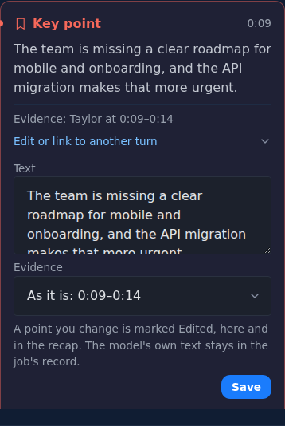
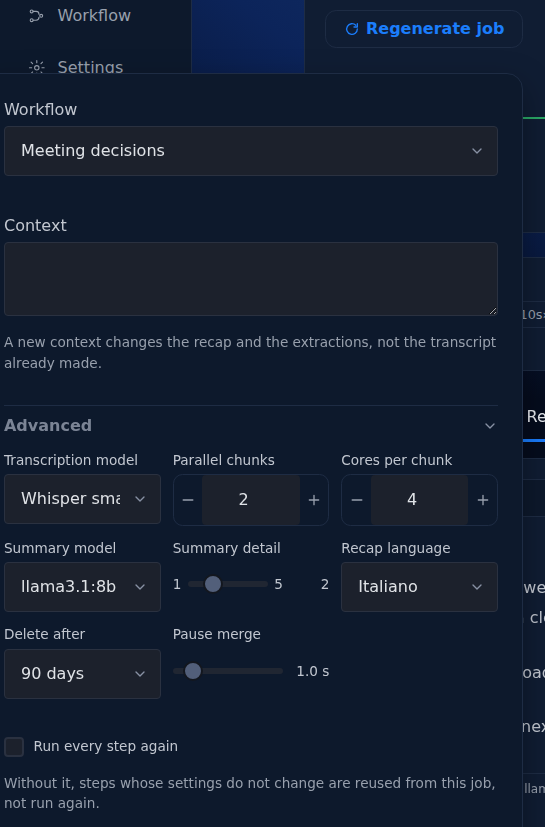

# Correct and regenerate

You correct a point of a recap by hand, and you regenerate a job to run it again with other choices. A correction is kept beside what the summary model wrote, and a regeneration replaces the job it comes from.

## Correct a point

Under each card of the **Verified output** in the **Transcript** tab, **Edit or link to another turn** opens two fields.

1. Open the **Transcript** tab and find the card of the point.
2. Open **Edit or link to another turn** under the card.
3. Change **Text**, up to 4,000 characters, to read as the point should read.
4. In **Evidence**, choose the turn the point rests on, from the same turns as the bubbles beside the cards. **As it is** keeps the current evidence, and shows it; a point without evidence offers **No turn**.
5. Press **Save**.

    You should see: the **Transcript** tab again, and the point marked **Edited** on its card and in the **Recap** tab. A point you tied to a turn by hand no longer shows **Needs review**.

The exports use the corrected text. What the model wrote is not lost: the correction is kept in its own file in the job's folder, `edits.json`, next to the model's output, which the job's record (`manifest.json`) keeps unchanged and hashed.

A correction belongs to the job. A regenerated job starts again from what the model writes, and when it replaces the old job, the old job's `edits.json` goes with it.

Speaker names and the speaker of a single sentence are corrected elsewhere; see [Speakers](speakers.md).

## Regenerate a job

**Regenerate job** runs the job again on the same recording, with the workflow, the context or any advanced option changed. The button is in the head of the job page for a job that is completed, failed, interrupted or cancelled. The **Jobs** page offers **Regenerate** in the menu of a completed job; for a failed job, use **Retry this step**, as the section "Retry and Regenerate" explains.

1. Open the job and press **Regenerate job** in its head.

    You should see: a panel with **Workflow**, **Context**, **Advanced** (open, starting from this job's own values) and **Run every step again**.

2. Change what you want: another workflow, a new context, a summary detail, a recap language, a model.
3. Press **Regenerate job** in the panel.

    You should see: the page of the new job, running. If nothing changed and **Run every step again** is off, every step is reused, and the page says "Nothing changed, so every step was reused from the previous job", and points to **Run every step again**.

### What is reused

Each step is reused from the job it comes from when what it reads and how it runs are unchanged. A step that changed runs again, and so does every step after it that reads its output.

| What you change | What runs again |
|---|---|
| **Context** | the steps that write the recap and the extractions; the transcript and the speakers are reused |
| **Summary detail** | the **Recap** step |
| **Recap language**, **Model server** | the steps that write the recap and the extractions |
| **Workflow** | the steps the new workflow adds or changes; steps with the same skill on the same input are reused, as when a **Lesson companion** job is regenerated as **Research interview** and only the themes are computed |
| **Transcription model** | every step: the audio is transcribed again, so the new job keeps neither this transcript nor the speakers fixed sentence by sentence |
| **Summary model** | every step, transcription and speaker diarization included: in Voxtrama 0.1 the summary model is part of what identifies every step of a job, so the new job transcribes the audio again and keeps neither this transcript nor the speakers fixed sentence by sentence |
| **Pause merge**, **Delete after** | no step: they change how the transcript reads and how long the job is kept |

**Run every step again** runs everything from the start, even when nothing changed. Use it when the models or Voxtrama itself have changed since the job ran.

Another transcription model shows a warning in the panel: "Another transcription model transcribes the audio again: the new job will not keep this transcript, nor the speakers fixed sentence by sentence."

### What replaces what

When the new job finishes well, it replaces the old one. The old job is deleted, whatever its state, and its address leads to the new job, so a bookmark or a link pasted somewhere keeps working. No versions are kept.

If the new job fails, the old job stays as it was, and the failed job stands next to it so you can retry it. If you regenerate the same job twice, the first new job to succeed replaces it, and the second then replaces the first. A job that another running job was started from is left in place until that one ends.

## Retry and Regenerate

**Retry this step** and **Regenerate job** both start a new job on the same recording that reuses finished steps, and both replace the job they come from once they succeed. They differ in what you can change.

| | Retry this step | Regenerate job |
|---|---|---|
| Where | the banner of a failed job | the head of the job page |
| What changes | nothing: same workflow, same choices | anything the new-job form offers |
| What runs | the step that failed and the steps after it | the steps whose inputs or settings changed |
| When to use it | the cause is outside the job: Ollama was down, the worker was killed, memory was short | you want another result: another model, context, workflow or detail |

A retry carries no new settings. When the cause is a setting, such as the memory the job may use, change it with **Open settings** first.

## Related pages

- [Read and check the results](results.md)
- [Follow a job](follow-a-job.md)
- [Speakers](speakers.md)
- [Jobs, search and clean-up](jobs.md)
