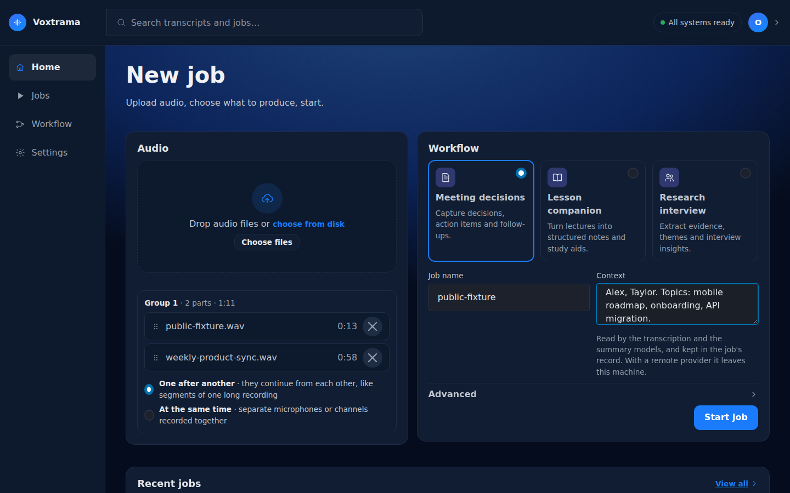
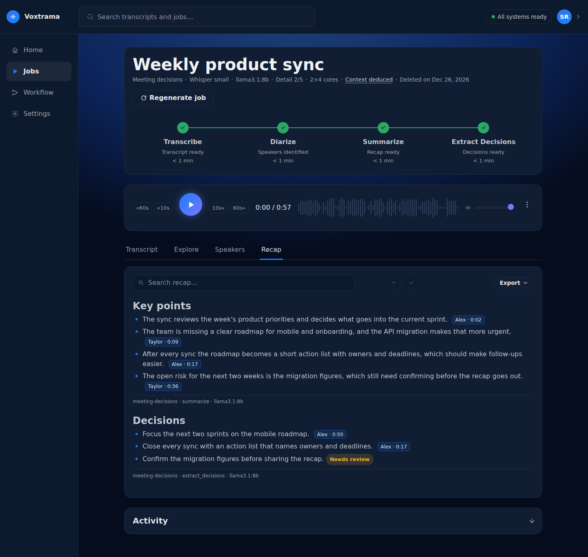

# Your first job

Your first job takes a recording from an upload to a transcript with speakers, and, with a summary model, to a recap whose every point links to a quote you can play back. Two routes lead there: the web interface, and the `voxtrama demo` command, which needs no audio file of your own.

## Before you start

You need a running installation that has finished [First start](first-start.md): the transcription model is downloaded and the data folder passes its write test.

A recap needs a summary model. Without one, the job still produces the transcript and the speakers, and fails at the recap step with the banner **No summary model configured**. [Set up the summary model](summary-model-setup.md) first, or tick **Transcription only, no summary** in step 4 of the procedure.

## Run a job in the web interface

1. Open Voxtrama in your browser, at the address your installation uses (`http://localhost:8000` unless you changed the port).

    

    You should see: the **New job** page, with an **Audio** card, a **Workflow** card and a **Start job** button.

2. Drop an audio file on the **Audio** card, or press **Choose files** and pick one.

    You should see: the file name and its length in a list under the drop area, and **Job name** filled in with the file name.

3. Choose a workflow card. For a recording of a meeting, pick **Meeting decisions**.

    You should see: the card highlighted.

4. Optional: type a few words in **Context**, for example "Weekly product sync. People: Alex, Taylor. Topics: mobile roadmap, API migration." Names and acronyms written here are spelled correctly in the transcript and the recap.

5. Press **Start job**.

    You should see: the job page, with a chain of steps (Transcribe, Identify speakers, then the steps that write the recap) and an **Activity** panel that fills with lines as the worker runs. If the button reads **A job cannot start yet**, the lines under it say what is missing and link to the setting that fixes it.

6. Wait for the state **Succeeded**. You can close the page and come back: the job runs in the worker, not in the browser. [Follow a job](follow-a-job.md) explains every part of the page and how long a job takes.

    You should see: the chain with every step marked done, and the five tabs **Transcript**, **Explore**, **Speakers**, **Recap** and **Files**. The page opens on the **Recap** tab.

7. Press a point in the **Recap** tab that shows a speaker and a time, such as "Alex · 4:12".

    You should see: the audio player jump to that moment and play the quote the point rests on.

8. Open the **Speakers** tab, type a name for each voice and press **Save names**.

    You should see: the names replace `spk0`, `spk1` and so on in the transcript, in Explore and beside the recap points.

9. Open **Export** in the **Recap** tab and choose **PDF**, **HTML** or **DOCX**, or open the **Files** tab to download the transcript.

    You should see: a file named after the job in your downloads folder.

!!! warning "Check before you rely on it"
    A point marked **Needs review** has no quote Voxtrama could find in the transcript. Listen to the recording before you use it. [Read and check the results](results.md) shows how.



## Run the demo from the command line

`voxtrama demo` runs a sample recording shipped with Voxtrama through the **Transcribe only** workflow, so it needs no file and no summary model. The sample has two speakers and lasts about 13 seconds.

1. Run the command in the folder that holds your `compose.yaml`:

    ```bash
    docker compose exec web voxtrama demo
    ```

    You should see: the line `Running the 'transcribe-only' workflow on the bundled sample (public-fixture.wav): two speakers, about thirteen seconds.` then the id of the job and its progress. On the first run on a machine, Voxtrama first says how much it will download (the Whisper model and the speaker model) and about how long that takes.

2. Wait for the command to finish.

    You should see: the command ending without an error. A job that fails ends the command with exit code 1. If no worker picks the job up within 30 seconds, the command prints `Still queued: no worker has picked it up. The run is not lost.`

3. Open **Jobs** in the side bar of the web interface.

    You should see: the demo job, workflow **Transcribe only**, status **Completed**. Open it to see the transcript and the two speakers. The **Recap** tab says "This job produced a transcript only, with no recap.", because **Transcribe only** has no recap step.

If the command prints `Demo audio missing`, the sample file is not in the image or in the clone you run from.

## Related pages

- [Start a job](new-job.md)
- [Follow a job](follow-a-job.md)
- [Read and check the results](results.md)
- [Speakers](speakers.md)
- [Command line](cli.md)
