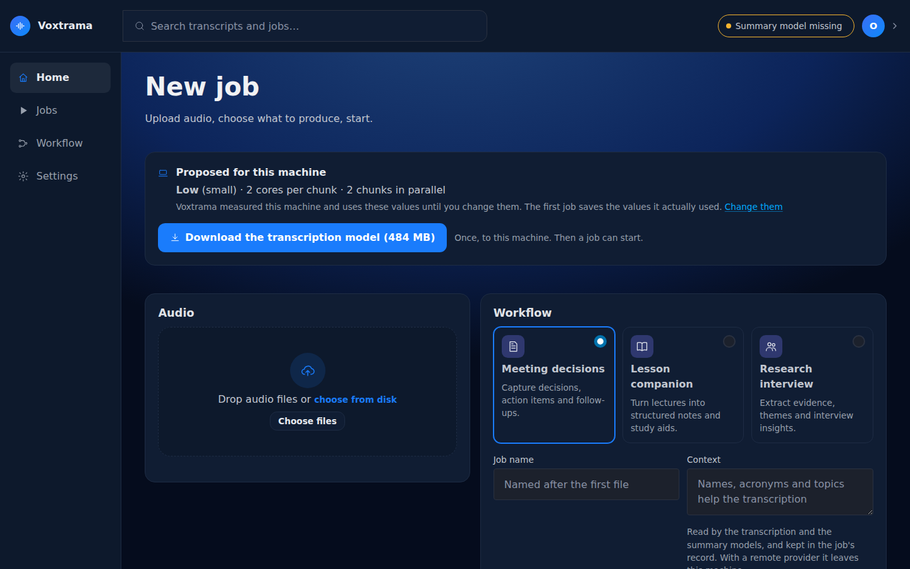

# First start

The first time you open Voxtrama it takes you to a short guided setup, three
steps you can follow or skip. Voxtrama has already measured your machine and
proposes the settings to use; one download stands between you and the first
job.

If you would rather start a job straight away, press **Skip setup, use the
proposal** on the first step. The home page then opens on the new-job form,
with the proposal described below, and the setup stays under **Settings**.

## What Voxtrama proposes

The card at the top of the home page, **Proposed for this machine**, shows
three values:

- **the profile**, which decides the transcription model:

    | Profile | Model | Download |
    |---|---|---|
    | Low, "Efficient" | Whisper small | 484 MB |
    | Base, "Balanced" | Whisper medium | 1.5 GB |
    | High, "Maximum accuracy" | Whisper large-v3 | 3.0 GB |

- **cores per chunk**: how many processor cores work on one piece of the
  recording;
- **chunks in parallel**: how many pieces are transcribed at the same time.

The proposal fits the cores and memory Voxtrama found. It is used until
you change it, and **Change them** opens the settings where you can pick
another profile or other numbers.

## The one download

Press **Download the transcription model**. The model is downloaded once,
to your data folder, and the card shows the progress. When it is done the
form below it can start a job.

The speaker model (83 MB) is downloaded on the first job that needs it.

!!! tip "The header chip"
    The chip at the top right says whether a job can run end to end. On a
    new installation it often says "Summary model missing": transcription
    works, but recaps need a summary model. See
    [Summary models and servers](model-servers.md).

## The first job

Pick a workflow, add a file and press **Start job**. The next pages
explain each part: [Start a job](new-job.md) and
[Follow a job](follow-a-job.md).

After the first job finishes well, Voxtrama writes the values it
used to `voxtrama.toml` in the data folder. From then on that file holds
your installation's settings. It is plain text: you can read it, edit it,
or copy it to another machine.

## The guided setup

If you prefer to decide everything before the first job, the guided setup
walks through three steps. Open **Settings** and choose **Restart setup**,
or go to `/setup/local-processing`:

1. **Local processing**: the three profiles, each with its download size,
   an estimate of how long an hour of audio takes on this machine, and the
   licence of the model. **Fine-tune** sets the cores and chunks.
2. **Model ready**: the summary model. Voxtrama looks for Ollama on this
   machine and lists the models it has. You can skip this step.
3. **Private storage**: the data folder, checked with a real test file,
   and a summary of what will be saved. **Finish setup** writes
   `voxtrama.toml`.

Deleting `voxtrama.toml` makes the next visit a first start again. Your
recordings and jobs stay where they are.
