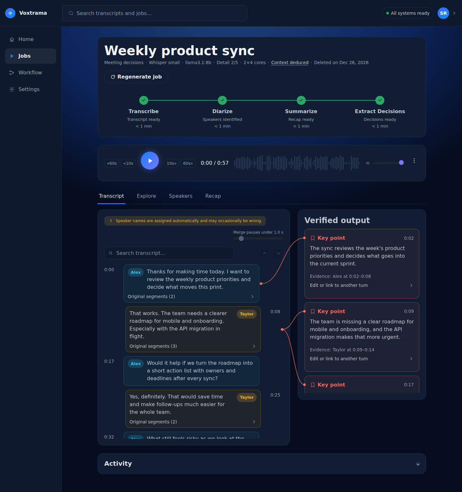
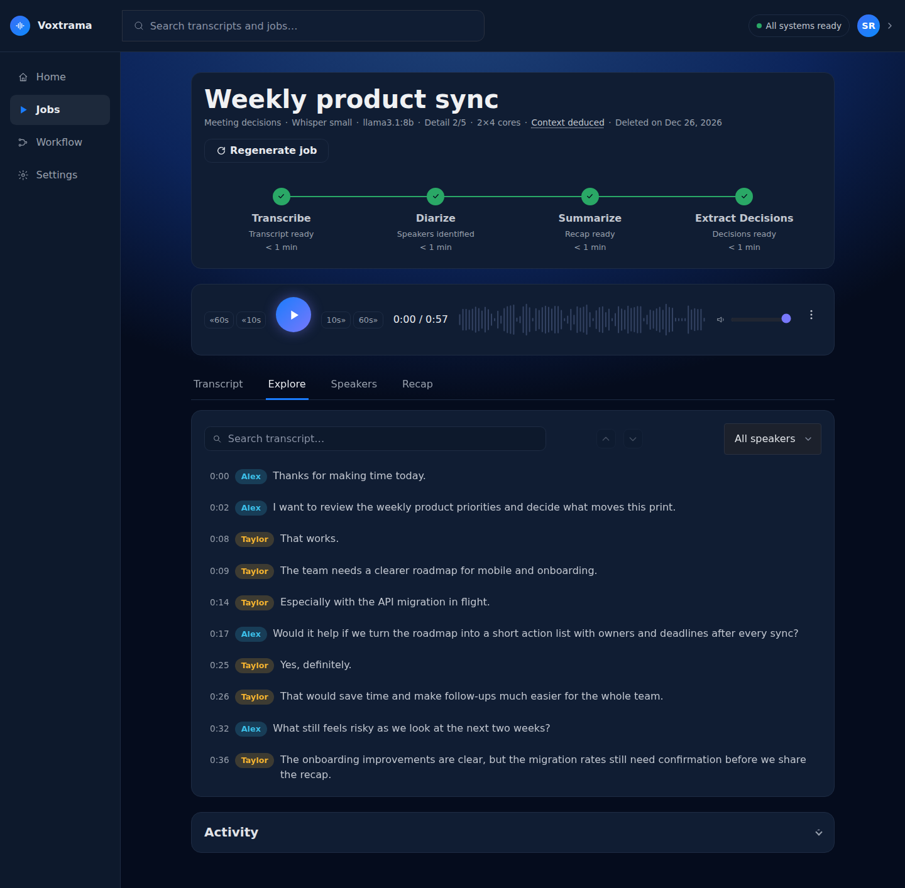
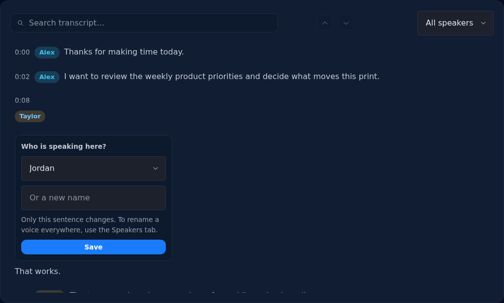
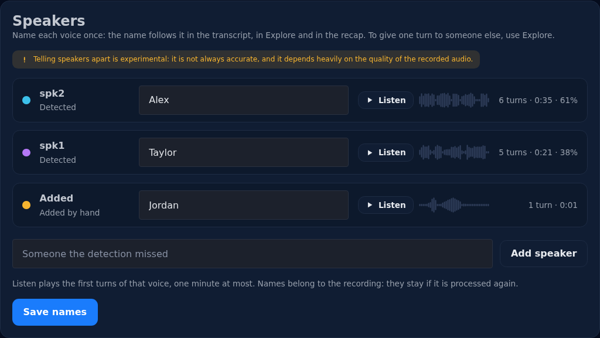

# The job page

A finished job opens on its recap. The page has three parts: the head of
the job, the audio player, and four tabs (Transcript, Explore, Speakers,
Recap). Switching tab does not reload the page, so the audio keeps playing.

## The head

The title is the job name. The line under it says what the job ran with:
the workflow, the Whisper model, the summary model, the detail level, the
cores it used, and how long the job is kept.

- **Context ✓** means someone wrote a context for the job.
- **Context deduced** means nobody did, and Voxtrama deduced one from the
  transcript: who is speaking, what about, which names and acronyms
  recur. Open it to read what was deduced. The transcript wins where the
  two differ.
- **N windows of ~12k characters** appears when the transcript was long
  enough to be read in parts.

The chain of steps under the head shows how long each step took. A step
reused from an earlier job says **Reused** instead
([Regenerate](#regenerate-a-job) explains when that happens).

## The player

«60s, «10s, 10s» and 60s» move through the audio. Click the waveform to
jump to a moment; with the waveform focused, the arrow keys move five
seconds at a time. The **⋮** menu downloads the audio.

Every time shown on the page (a sentence in the transcript, a point in
the recap) is a button that plays the audio from there.

## Recap

The recap has one section per kind of result: **Key points**, then
**Decisions**, **Themes** or **Concepts** depending on the workflow. Each
point shows the speaker and the time of the quote it rests on. Each
section ends with the workflow, the step and the model that wrote it.

### Needs review

Every point the summary model writes must quote the transcript. Voxtrama
looks for that quote in the transcript:

- found: the point shows the speaker and the time, and playing it takes
  you to the passage;
- not found: the point is marked **Needs review**. The model may have
  paraphrased, or written something that was never said. Listen to the
  recording before relying on it.

A point that needs review never fails the job; it is shown and marked.

A point you corrected by hand (see [Correct a point](#correct-a-point))
shows **Edited**.

### Export

**Export** saves the recap as **PDF**, **HTML** or **DOCX**, named after
the job. **Manifest (JSON)** saves the job's record: which models ran,
with which settings, on which file. In the downloaded manifest, the
context and the server addresses are replaced with `[removed]`; the copy
in the data folder keeps everything.

## Transcript

The transcript is shown as turns, one bubble per speaker turn, with the
**Verified output** beside it: each point of the recap and of the
extractions, linked to the turn it quotes.

- **Merge pauses under** joins the sentences of one speaker separated by
  less than this many seconds into one turn. It changes the reading, not
  the transcript. **Original segments** opens the sentences a turn is made
  of.
- **Search transcript** finds a word and moves between the matches.

The name on each bubble only says who speaks. Names are given in the
[Speakers](#speakers) tab, and a sentence is given to someone else in
[Explore](#give-one-sentence-to-someone-else).

### Correct a point

Under each card of the verified output, **Edit or link to another turn**
opens two fields:

- **Text**: the point as it should read.
- **Evidence**: the turn it rests on, from the same turns as the column
  beside it. **As it is** keeps the current one.

**Save** reopens the Transcript tab. The point is marked **Edited** on its
card and in the recap, and the exports use the corrected text. A point you
tied to a turn by hand no longer shows **Needs review**.

What the model wrote is not lost: the correction is kept in its own file
in the job's folder (`edits.json`), next to the model's output, which the
job's record keeps unchanged. A regenerated job starts again from what
the model writes.

## Explore

Explore lists every sentence with its time and speaker, one per line. Use
it to search the whole recording or filter one speaker with **All
speakers**. Click a line, or press Enter on it, to play from there.

### Give one sentence to someone else

When a single sentence is attributed to the wrong person, click the
speaker on that line and choose who is speaking there: someone already
named on the recording, a speaker you added, or a new name. **The
detected speaker** puts it back.

Only that sentence changes. The speaker's other sentences, and the name of
the voice, stay as they are. This is the only place where a single
sentence is changed.

## Speakers

Voxtrama tells the voices apart and labels them `spk0`, `spk1` and so on.
The Speakers tab lists them, the voice that speaks most first, then the
speakers you added by hand. For each one:

- how many turns it has, how long it speaks, and its share of the
  recording. A sentence you gave to someone else in Explore counts for
  them;
- **Listen**, which plays the first turns of that voice, one minute at
  most, on the job's own player. The small waveform beside it fills as
  they play. Click again, or pause the player, to stop;
- a field for its name.

### Name the speakers

Write a name for each voice and click **Save names**. The name then
appears everywhere the voice does: on the bubbles, in Explore, beside the
points of the recap and in the exports. The transcript shows the first
name; the full name stays here.

- A blank field leaves that voice as it is.
- Names belong to the recording, not to the job: they stay if the
  recording is processed again, and every job on it shows them.
- To rename a voice, change its name and save again.

### Add a speaker

If the detection missed someone (two people with similar voices, or
someone who spoke very little), write their name under the list and click
**Add speaker**. They appear as **Added**, with no turns. Then give them
their sentences one by one in
[Explore](#give-one-sentence-to-someone-else).

### When the speakers are wrong

Telling speakers apart is experimental: it is not always accurate, and it
depends heavily on the quality of the recorded audio. It works best when:

- each person is close to a microphone, and the room is quiet;
- people speak one at a time;
- the voices are different enough (two similar voices are often merged).

Voxtrama tells apart up to four voices by default. For a meeting with more
people, set `VOXTRAMA_MAX_SPEAKERS` in `.env` (see
[Configuration](configuration.md)) and regenerate the job with **Run every
step again**.

## Regenerate a job

**Regenerate job** runs the job again on the same recording. The panel
starts from this job's own values; change the workflow, the context or
any advanced option.

- Steps whose settings do not change are **reused** from this job, not run
  again. A new context, for example, runs the recap and the extractions
  again but keeps the transcript.
- Another transcription model transcribes the audio again, so the new job
  keeps neither this transcript nor the speakers fixed sentence by
  sentence.
- **Run every step again** runs everything from the start, even when
  nothing changed. Use it when the models or Voxtrama itself have changed
  since the job ran.

When the new job finishes well it **replaces** this one: the old job is
deleted and its address leads to the new job. If it fails, the old job
stays as it was.

If you regenerate without changing anything, every step is reused and
the page says so.
