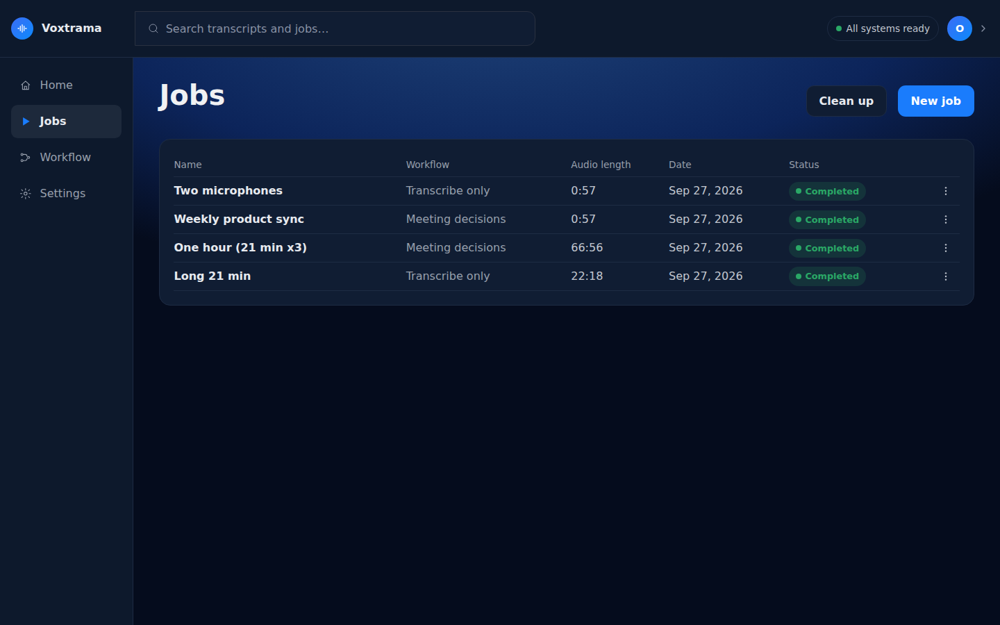
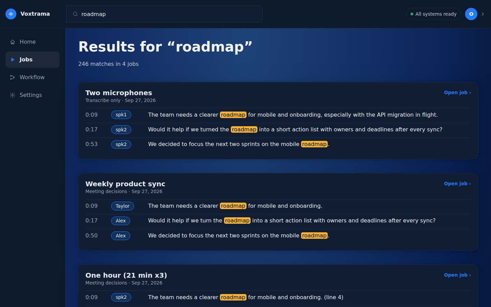

# Jobs, search and clean-up

**Jobs** in the side bar lists every job, newest first. Search finds a word in any finished transcript, delete removes what you choose, and clean-up and retention remove what nobody needs any more.

## The Jobs page

The **Jobs** page shows one row per job, with the columns **Name**, **Workflow**, **Audio length**, **Date** and **Status**. The date is shown in your own time zone. A running job shows how many of its steps are done, such as "2 of 4". **Clean up** and **New job** are at the top of the page.



The **⋮** menu on each row has these entries:

| Entry | When it is offered |
|---|---|
| **Open** | always |
| **Regenerate** | for a completed job; a failed job has **Retry this step** on its own page |
| **Delete...** | once the job has finished; stop a running job from its page first |

| Status | Meaning |
|---|---|
| **Queued** | waiting for the worker |
| **Running** | a step is running |
| **Completed** | every step finished |
| **Failed** | a step failed; what finished before it is kept |
| **Cancelled** | stopped on request |
| **Interrupted** | the worker stopped during the job |

The home page lists the latest jobs under **Recent jobs**, with a **View all** link to this page. It uses the same statuses, plus **Not started** for a recording that was imported but has no job yet, whose menu entry is **Choose workflow**.

## Search

The search field at the top of every page, **Search transcripts and jobs...**, looks through the text of every finished transcript and every job name. Type at least two characters, and press **Search**. A shorter query shows "Type at least two characters."

The results page says "N matches in M jobs", groups the results by job and shows the time, the speaker and the sentence with the match marked. Click a result to open the job at that sentence. A job found only by its name says "Found in the job's name." At most 500 results are returned. A search without results says "The search produced no results."



Search does not look into recaps, extractions or settings. To search a recap, use **Search recap** in the job's **Recap** tab; see [Read and check the results](results.md).

## Delete a job

**Delete...** in a job's menu opens a dialog titled **Delete "job name"?** with the text "Choose what to delete. Anything you leave unchecked stays." It has three boxes, in this order:

| Box | What it removes | Default |
|---|---|---|
| **Audio** | the recording's files; disabled when the job has no recording | unchecked |
| **Transcript** | this job's transcript | unchecked |
| **Recap** | the recap and the extractions; the transcript and the audio stay, and the job can be regenerated from them | checked |

Anything left unchecked stays. "All three removes the job itself." Press **Delete selected** to confirm, or **Cancel**.

Each job behaves as if its audio were its own. A regenerated job uses the same recording as the job it came from; deleting either one, or only its audio, never touches the other:

- deleting the whole job keeps the recording for the other job;
- deleting only the audio takes the player away from this job, and the other job keeps the audio;
- the files are removed with the last job that uses them.

While a job regenerated from this one is still running, this job cannot be deleted: wait for it to finish. Only finished jobs can be deleted.

## Clean up

**Clean up** on the **Jobs** page removes leftovers, and then says "Leftovers removed: N." or "Nothing to clean up." It removes:

| What | Rule |
|---|---|
| failed, cancelled and interrupted jobs | they ended 7 days ago or more, which leaves a week to press **Retry this step** |
| recordings that no job uses | they were imported 7 days ago or more |
| folders in `runs/` or `recordings/` that belong to no job | they were left by a crash or by an older delete, and have been untouched for 1 hour, so that a job being created right now is never taken for one |

A job that another running job was started from is kept until that one ends. The folder of a job emptied by retention stays on purpose, as the proof of the deletion.

Clean-up first applies retention. The worker also cleans up this way when it starts and once a day.

## Retention

Retention deletes finished jobs after a number of days. A job past its limit loses its audio, transcript, recap and files. Only an emptied record stays, saying that the job existed and when and under which limit it was deleted.

1. Open **Settings** in the side bar, then **Data & privacy**.
2. Under **Data retention**, choose a value in **Delete finished jobs after**: **Never** (the default), 7, 30, 90 or 365 days.
3. Press **Save**.

    You should see: the new value selected. Retention does not run the moment you save.

Three levels can set a limit, and the strictest wins:

| Level | Where it is set |
|---|---|
| the installation | **Delete finished jobs after** in **Data & privacy**, or `VOXTRAMA_RETENTION_DAYS` (1 to 36500) in `.env` |
| the workflow | the retention of its skills; by default a skill follows the recording |
| the job | **Delete after** in the new-job form, or in the **Regenerate job** panel |

A job can ask to be kept for less time, never for more. A recording that another job still uses is kept.

Retention runs when the worker starts, once a day, and on **Clean up**. The job page shows when a job will be deleted, as **Deleted on** and a date, or how long it is kept, as **Kept N days**, but only for a job that a limit applies to.

To check what retention removed, run:

```bash
docker compose exec web voxtrama retention
```

The command prints the installation limit, then one line per emptied job with its id, the date of the deletion, the limit and the level that set it, and "nothing left" or `LEFT:` with what remains. It prints "No job has been deleted by retention." when there is none, and ends with exit code 1 when anything is left on disk or in the database.

## Related pages

- [Start a job](new-job.md)
- [Correct and regenerate](correct-regenerate.md)
- [Configuration](configuration.md)
- [Command line](cli.md)
- [Privacy and data](privacy.md)
