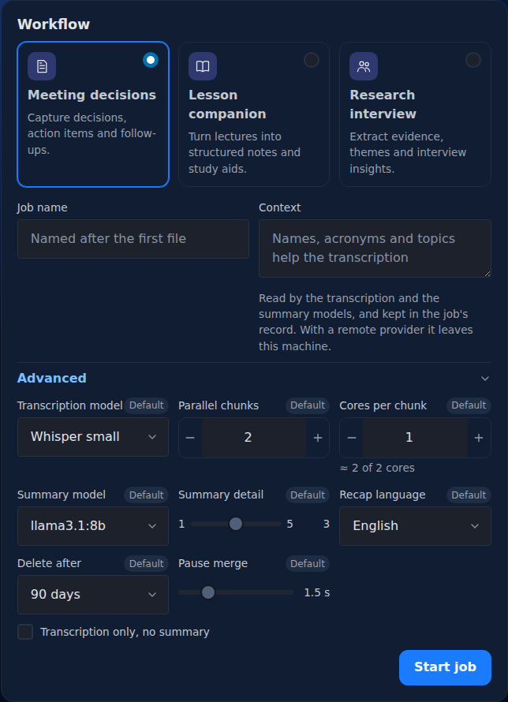

# Start a job

A job is one recording, one workflow and the choices it runs with. You start it from the home page, which is titled **New job**.

## Add the audio

The **Audio** card takes one or more audio files: drop them on it, or press **Choose files**. The file picker offers audio files only, and a dropped file that is not audio is refused with "Only audio files can be added."

Voxtrama checks each file when you press **Start job**, not when you add it. It refuses a file in these cases:

| What happens | What you see |
|---|---|
| The file is not a recognised audio or video container | **The file is not a supported audio format** |
| The file has no audio track | the detail says "has no audio stream" |
| The length of the file cannot be read | the detail says "could not determine the duration" |
| The form is sent without a file | **No audio was given** |

A recognised container that holds an audio track is accepted, including video containers such as MP4, MOV, MKV, WebM and AVI. The audio formats include WAV, FLAC, MP3, M4A, OGG, AAC and AIFF.

A single file is stored untouched in the data folder. Voxtrama makes a 16 kHz mono WAV copy named `resampled_16k.wav` next to it, for the steps to read, unless the file already is a 16 kHz mono WAV.

### Upload limits

An upload is checked before Voxtrama reads any of it.

| Limit | Value | What you see when it is not met |
|---|---|---|
| Size of one upload (all the files of the job together, as one request) | 8 GB by default, set by `VOXTRAMA_MAX_UPLOAD_MB` (8192) | **The upload is too large**, with "N MB sent, M MB at most" (status 413) |
| Free space in the data folder | three times the size of the upload | **Not enough room in the data folder**, with the space needed and the space free (status 507) |
| Size announced by the browser | the request must declare its length | **The upload did not say how large it is** (status 411) |
| Installation ready | the models, the storage and the database must be ready | **This installation cannot take a recording yet**, naming what is missing (status 503) |

The factor of three exists because the upload is written twice before the job owns it: first in a scratch folder, then as the stored recording with its 16 kHz copy.

### Several files in one job

When you add two or more files, the **Audio** card lists each part with its length under **Group 1**, and asks **How are these files related?**

| Choice | What it means | What Voxtrama does |
|---|---|---|
| **One after another** (default) | the parts continue from each other, like segments of one long recording | joins them in the order shown |
| **At the same time** | separate microphones or channels recorded together | mixes them into one track, aligned at the start, and tells the speakers apart from the mix |

Drag a part by its grip to change its order, or remove it with its cross. With **At the same time** the grips disappear, because tracks have no order.

Only the joined or mixed result is kept: a lossless FLAC file at 48 kHz, mono. The separate files you uploaded are not stored. The parts may differ in format, sample rate and channels.

## Pick a workflow

The **Workflow** card offers one choice per workflow. Every workflow transcribes the audio and tells the speakers apart first.

| Workflow | Card text | What it produces besides the transcript |
|---|---|---|
| **Meeting decisions** | Capture decisions, action items and follow-ups. | a recap, and the decisions with their owner and deadline |
| **Lesson companion** | Turn lectures into structured notes and study aids. | a recap, and the key concepts with their definitions |
| **Research interview** | Extract evidence, themes and interview insights. | a recap, and the themes with the insight behind each one |

A custom workflow you built appears as a further card. To get the transcript and the speakers without any recap, open **Advanced** and tick **Transcription only, no summary**; that runs the **Transcribe only** workflow. [Workflows and skills](workflows.md) explains each step and how to build your own workflow.

## Name and context

| Field | Limit | What it does |
|---|---|---|
| **Job name** | 200 characters | Starts filled with the first file's name, until you type your own. |
| **Context** | 2,000 characters | A few words about the recording. Names, acronyms and topics help most. |

An example context: "Weekly product sync. People: Alex, Taylor. Topics: mobile roadmap, API migration."

Whisper, the transcription model, reads only the first 600 characters of the context, and uses them to spell those names right. The summary model reads the whole context, and is told that where the context and the transcript disagree, the transcript wins. Whisper also receives a short neutral opening sentence in the job's language, which makes it punctuate; the opening goes before your context.

When you leave **Context** empty, Voxtrama deduces a context from the transcript before the recap. The job page then shows **Context deduced** in its head. If the deduction fails, the job goes on without a context.

!!! warning "Context and remote servers"
    The context is kept in the job's record. If the job runs on a remote model server, the context is sent there along with the transcript. The downloaded manifest replaces both the context you wrote and a deduced one with `[removed]`.

## Advanced options

**Advanced** is closed by default. It opens the choices this one job can make. Each field starts from the installation's own setting and shows the tag **Default**. A field you move shows **Changed**, and only changed fields become the job's own choices.

| Option | Values | What it does |
|---|---|---|
| **Transcription model** | Whisper small, medium or large-v3 | Larger is more accurate and slower. A model not downloaded yet is downloaded by the job before it starts transcribing. |
| **Parallel chunks** | 1 to 64 | How many pieces of the recording are transcribed at the same time. |
| **Cores per chunk** | 1 to 64 | How many processor cores each piece uses. |
| **Summary model** | the models listed | Which model of the model server writes the recap and the extractions. |
| **Summary detail** | 1 to 5, default 3 | How long the recap is. |
| **Recap language** | Italiano, English, Español, Français, Deutsch, Português, Nederlands, or **Same as the audio** | The language the recap and extractions are written in, and the language the audio is transcribed in. |
| **Model server** | the configured servers, each marked local or remote | Shown only when more than one model server is configured. |
| **Delete after** | the installation's limit or **Never**, then 7, 30, 90 or 365 days | When the job's audio, transcript and recap are deleted. |
| **Pause merge** | 0.5 to 5 seconds, default 1.5 | Two sentences of one speaker closer than this read as one turn. |
| **Transcription only, no summary** | checkbox | Runs **Transcribe only** instead of the chosen workflow. |

### Cores and parallel chunks

The hint under **Cores per chunk** shows the total that the two numbers ask for, parallel chunks times cores per chunk, against the cores the machine has. The hint turns into a warning when the total goes over.

Each of the two numbers is also checked on its own. A job that asks for more parallel chunks than the machine has cores, or for more cores per chunk than it has, is refused before it starts, and is never silently reduced. The machine's cores are its performance cores where the platform separates them, otherwise all its cores. The fields accept 1 to 64 and start from the proposal Voxtrama measured for the machine.

### Summary model list

The **Summary model** list holds the model configured in the installation, plus every model measured during setup on the **Model ready** page. It is not read live from the model server. With no model configured, the list shows **No summary model configured**. [Summary models and servers](model-servers.md) explains how to add one.

### Summary detail

| Level | What the summary model is asked for |
|---|---|
| 1 | the 3 most important points, one short sentence each |
| 2 | about 5 points, one or two sentences each |
| 3 (default) | about 8 points covering every main topic, two or three sentences each |
| 4 | about 12 points covering every topic discussed, a short paragraph each |
| 5 | every theme: one point per minute of recording, from 15 to 40, each a paragraph of four to six sentences, with a quote for each point |

A long transcript is read in windows of about 12 000 characters, and each window is asked for its share of the points, so the whole recap keeps about the length the level promises. A window that does not fit in the summary model's context makes the step fail; [Summary models and servers](model-servers.md) explains the limit.

### Recap language and language detection

**Recap language** starts from your browser's language when Voxtrama offers it, and it sets the language the audio is transcribed in. Voxtrama listens to the first 90 seconds of speech before transcribing. If that speech is clearly in another language, with a probability of 0.8 or more, the language of the audio wins for the transcript. An English recap asked for on Italian speech then does not make Whisper translate or invent words. The recap itself is still written in the language you chose.

With **Same as the audio**, the detected language is used for both. If the detection is not sure enough (under 0.5), Whisper detects the language on its own.

### Delete after

**Delete after** can only shorten the installation's retention, never lengthen it: the first entry is the installation's limit (or **Never**), and only shorter choices follow. The rules are in [Jobs, search and clean-up](jobs.md).

### Pause merge

**Pause merge** changes how the transcript reads in the **Transcript** tab, not the transcript itself. The same slider, **Merge pauses under**, is on the job page, where changing it runs nothing.

## Start

Press **Start job**. Voxtrama copies the files into the data folder, checks them, and opens the job page, where you can [follow the job](follow-a-job.md) as it runs.

If **Start job** is replaced by **A job cannot start yet**, the lines under it name what is missing, among **Local processing**, **Models ready**, **Private storage** and **Database**. Each line has a **Set it up** link to the setting that fixes it.

## Related pages

- [Your first job](first-job.md)
- [Follow a job](follow-a-job.md)
- [Workflows and skills](workflows.md)
- [Summary models and servers](model-servers.md)
- [Configuration](configuration.md)
