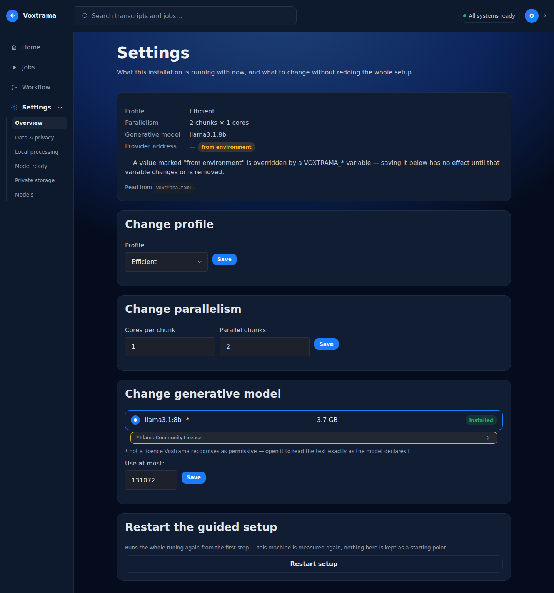
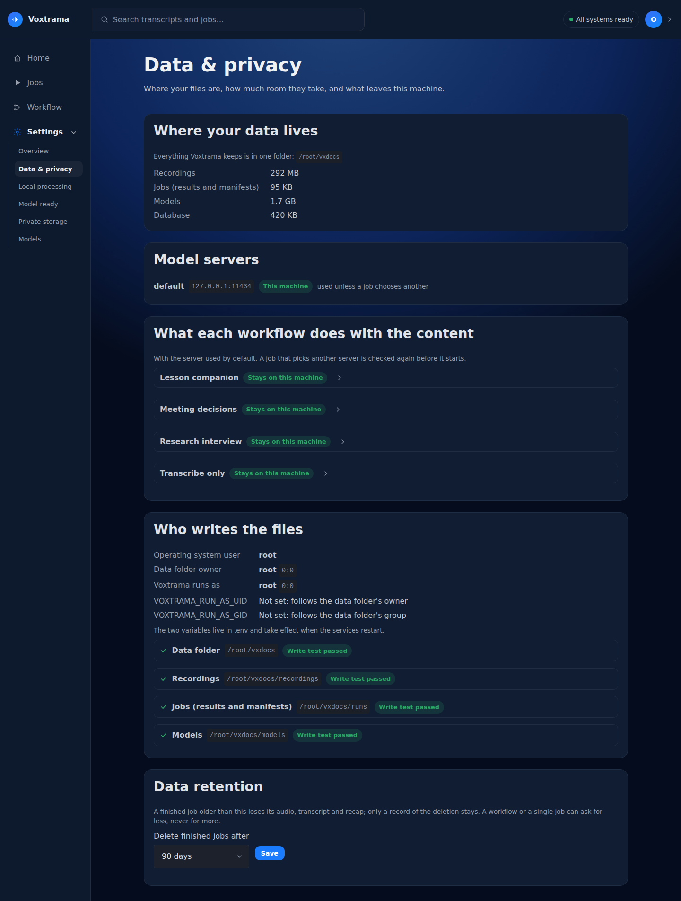
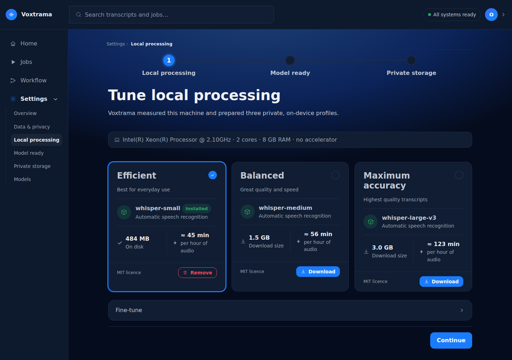
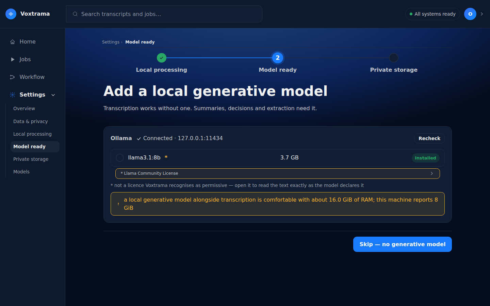
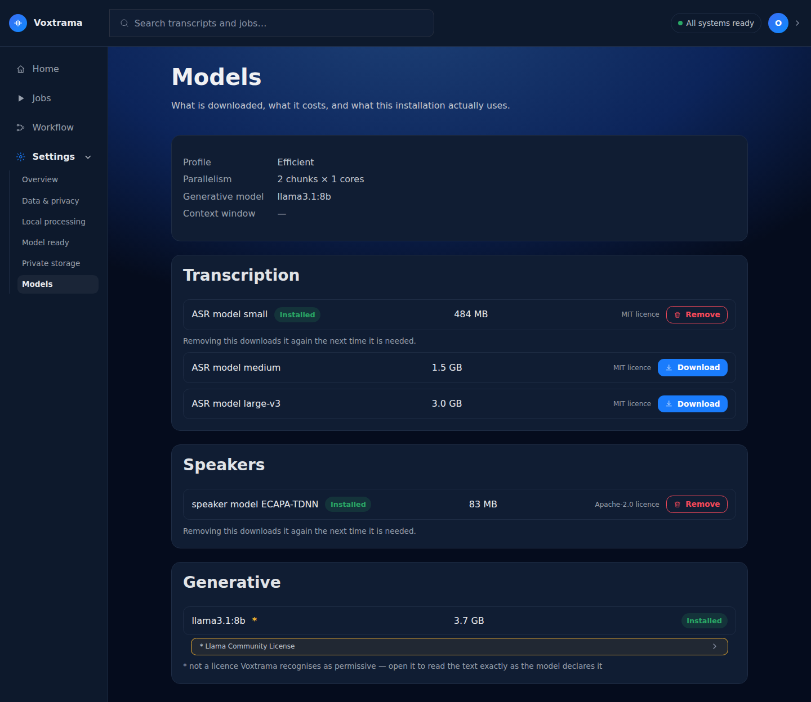

# Settings pages

**Settings** in the sidebar opens what this installation runs with. The values are saved in `voxtrama.toml` in the data folder, a plain text file you can also edit by hand.

## Where the pages are

The sidebar has four entries: **Home**, **Jobs**, **Workflow** and **Settings**. When **Settings** is open, it lists its pages in this order.

| Sidebar entry | Page title | What it is for |
|---|---|---|
| **Overview** | **Settings** | the current values, with a form for each |
| **Data & privacy** | **Data & privacy** | where the files are, what leaves the machine, who writes, retention |
| **Local processing** | **Tune local processing** | the transcription profile, the cores, the downloaded models |
| **Model ready** | **Add a local generative model** | the model server and the summary model |
| **Private storage** | **Where your recordings live** | the data folder, and the end of the guided setup |
| **Models** | **Models** | what is downloaded and what it costs on disk |

The avatar at the top right opens a menu. It shows your name and **Your profile** (or **Add your name** when no name is set), the theme choices, and **Settings**, which opens the same **Overview** page as the sidebar.

A pill in the header shows **All systems ready**, or the most blocking problem: **Ollama not responding**, **Summary model missing**, **Transcription model missing** or **Data folder unusable**. Opening the pill lists every problem, each with an **Open settings** link to the page that fixes it. The **Models** page is reached from the sidebar, under **Settings**.

## Overview

The **Settings** page opens with four facts, each marked **from environment** when a `VOXTRAMA_*` variable overrides the file: **Profile**, **Parallelism**, **Generative model** and **Provider address**. A line reads **Read from** `voxtrama.toml`. A notice explains that saving a value marked **from environment** has no effect until the variable changes or is removed.

Before the first setup, the page reads **This installation has not been set up yet.** with a **Go to setup** link.

Four forms follow, and saving one never changes the others.

| Form | Fields and buttons | What it does |
|---|---|---|
| **Change profile** | **Profile**: **Efficient** (Whisper small), **Balanced** (Whisper medium) or **Maximum accuracy** (Whisper large-v3); **Save** | sets the transcription model |
| **Change parallelism** | **Cores per chunk**, **Parallel chunks**; **Save** | sets how many cores each chunk uses and how many chunks run at the same time |
| **Change generative model** | the models the model server offers, each with its size and **Installed**; **Use at most:**; **Save** | sets the summary model, and caps its context window |
| **Restart the guided setup** | **Restart setup** | runs the guided setup again from the first step, with the machine measured again |

In **Change generative model**, **Use at most:** lowers the context window Voxtrama uses for that model. A limit that is too low makes a step fail, so lower it only when the model server runs short of memory. [Summary models and servers](model-servers.md) explains the behaviour.

When the model server is not set up, the form reads **Ollama is not configured: no generative model is offered.** When it does not answer, the form reads **Ollama is not reachable at** the host, with a **Recheck** link. When it has no models, the form reads **Ollama has no models installed yet.**

## Data & privacy

The page has five sections.

| Section | What it shows |
|---|---|
| **Where your data lives** | the data folder, and how much room **Recordings**, **Jobs (results and manifests)**, **Models** and **Database** take |
| **Model servers** | each configured server with its host, marked **This machine** or **Remote**, and the one **used unless a job chooses another** |
| **What each workflow does with the content** | for each workflow, **Part leaves this machine** or **Stays on this machine**, and for each step where it runs |
| **Who writes the files** | **Operating system user**, **Data folder owner**, **Voxtrama runs as**, `VOXTRAMA_RUN_AS_UID` and `VOXTRAMA_RUN_AS_GID`, and a write test on each folder |
| **Data retention** | **Delete finished jobs after**: **Never**, 7, 30, 90 or 365 days, and **Save** |

A step in **What each workflow does with the content** shows one of five places:

| Label | Meaning |
|---|---|
| **Inside Voxtrama** | the step runs in Voxtrama itself |
| **Model server on this machine** | the step runs on a model server on this machine |
| **Leaves this machine** | the step is sent to a remote model server |
| **Kept here: a job on** a server **is refused** | the step is `local_only`, and a job that would send it to that remote server is refused |
| **No model server configured** | no server is set up |

The list uses the default model server. A job that picks another server is checked again before it starts.

Each folder in **Who writes the files** shows **Write test passed** or **Cannot write**. When a test fails, the page says why (missing folder, read-only disk, wrong owner, permissions) and what to do. Retention is explained in [Privacy and data](privacy.md).

## Local processing

The **Tune local processing** page shows three profile cards, one for each transcription profile. A card gives the model, the download size (or **On disk** once downloaded, with **Installed**), an estimate of the time **per hour of audio** on this machine, and a link to the licence.

- **Download** fetches the model of a card, and **Remove** deletes it. A model you remove is downloaded again the next time a job needs it.
- **Fine-tune** holds **Cores per chunk** and **Parallel chunks**, each at most the cores of the machine. The section opens by itself when the numbers exceed the recommendation.
- **Download selected model** starts the download of the chosen profile, and becomes **Continue** when the model is on disk. While the download runs, the page reads **Preparing local processing**, with a progress bar and **Stop**.
- **Skip setup, use the proposal** appears only before the first setup is finished.

A card that does not fit the machine is disabled with its reason. If a chosen profile no longer fits, the page reads **That profile no longer fits. Pick another.** A failed download reads **The download failed:** followed by the reason.

## Model ready

The **Add a local generative model** page says where Voxtrama finds the summary model. Without one, transcription works, and summaries, decisions and extraction do not.

- A reachable server shows **Connected** with its host, a **Recheck** button, and its models, each with its size and **Installed**.
- A memory warning is shown when the recommended model looks too large for the machine.
- The **Context window** section shows **Maximum for this model:** in tokens and the **Use at most:** field. When the maximum cannot be read, the page says so and stores no ceiling.
- **Skip (no generative model)** leaves the page without choosing a model. **Continue** keeps the chosen one.

See [Summary models and servers](model-servers.md) for the server, the credentials and the context window.

## Private storage

The **Where your recordings live** page shows the data folder and three checks: **Folder exists**, **Writable: test file created and removed**, and the free space. In the guided setup, it ends with **Ready to start**, which lists **Name**, **Profile**, **Parallelism**, **Generative model** and **Data folder**, then reads **Saved to** `<data folder>/voxtrama.toml`. **Finish setup** saves the choices.

## Models

The **Models** page lists what is downloaded and what it costs on disk. At the top, **Profile**, **Parallelism**, **Generative model** and **Context window** show what the installation uses. Three sections follow.

| Section | What it lists |
|---|---|
| **Transcription** | the three Whisper models |
| **Speakers** | the speaker model |
| **Generative** | the models the summary model server offers |

Each downloadable model shows **Installed** or **Downloading**, its licence, and **Download** or **Remove**. Removing a model downloads it again the next time it is needed. A download that is already running blocks a second one with a notice.

## Your profile

The avatar menu opens **Your profile**, with **First name** and **Last name** and a **Save** button. The name is shown on the recordings and jobs you create, and it stays on this machine. In the Community Edition, the name is the only thing to set on this page.

## Related pages

- [Configuration](configuration.md)
- [Summary models and servers](model-servers.md)
- [Privacy and data](privacy.md)
- [First start](first-start.md)
