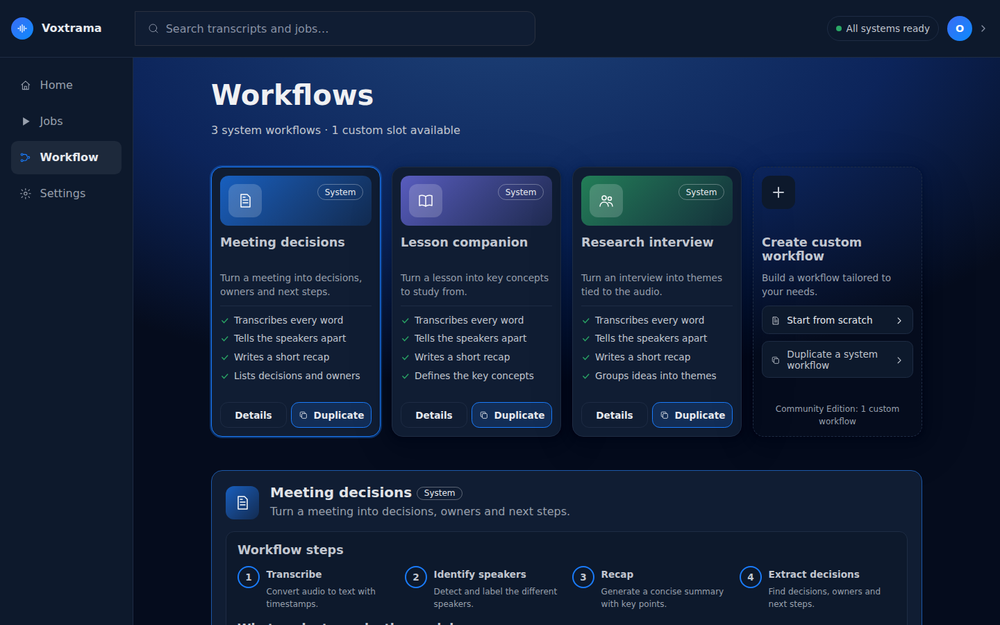
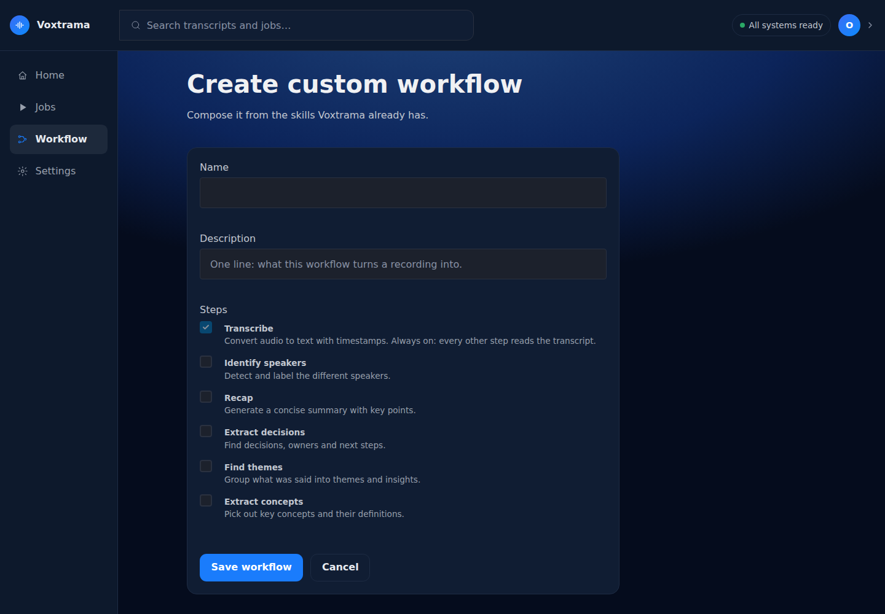

# Workflows and skills

A **workflow** is the list of steps a job runs. A **skill** is what one
step does: transcribe, tell the speakers apart, write a recap, extract
decisions. Voxtrama ships three workflows, and you can build one of your
own.

## The system workflows

| Workflow | Steps | What you read at the end |
|---|---|---|
| **Meeting decisions** | Transcribe, Identify speakers, Recap, Extract decisions | key points, and the decisions with owner and deadline |
| **Lesson companion** | Transcribe, Identify speakers, Recap, Extract concepts | key points, and the concepts with their definitions |
| **Research interview** | Transcribe, Identify speakers, Recap, Find themes | key points, and the themes with the insight behind each |
| **Transcribe only** | Transcribe, Identify speakers | the transcript with its speakers |

**Transcribe only** is the **Transcription only, no summary** box of the
new-job form rather than a card of its own.

**Details** on a workflow's card shows its steps and, under **What each
step asks the model**, the instructions each generative step sends to the
summary model. The highlighted parts are filled in for each job: the
transcript, the recap language and the detail level.

## The skills

| Skill | In the interface | Produces | Runs |
|---|---|---|---|
| `transcribe` | Transcribe | the transcript, with the time of each sentence | inside Voxtrama |
| `diarize` | Identify speakers | a speaker label on each sentence | inside Voxtrama |
| `summarize` | Recap | key points, each with a quote | on the summary model |
| `extract_decisions` | Extract decisions | decisions, each with owner, deadline and quote | on the summary model |
| `extract_themes` | Find themes | themes, each with an insight and a quote | on the summary model |
| `extract_concepts` | Extract concepts | concepts, each with a definition and a quote | on the summary model |

Transcription and speaker identification always run inside Voxtrama, on
this machine. The other four send the transcript to the summary model
server: on this machine by default, on another one if you configure it.
See [Summary models and servers](model-servers.md).

## Build your own workflow

**Create custom workflow** starts from scratch, or **Duplicate** starts
from a system workflow.

- **Name** (up to 60 characters) and **Description** (up to 140).
- **Steps**: tick the ones you want. Transcribe is always on, because
  every other step reads the transcript. The steps run in a fixed order:
  transcribe, identify speakers, recap, then the extractions.
- **Instructions**: each generative step starts from the system
  workflow's instructions, and you can rewrite them. They must contain
  `{transcript}`, where the transcript goes. `{language}` (the recap
  language) and `{detail}` (the detail level) are optional. To write a
  literal brace, write it twice: `{{` and `}}`.

The Community Edition allows **one** custom workflow. Edit it, or delete
it to create another. Deleting a workflow does not affect the jobs that
ran it: each job keeps its own copy of the workflow it ran.

System workflows cannot be edited or deleted. Their instructions are
read-only; duplicate one to change them.

## Swapping a step's skill

A workflow can declare, for a step, other skills a job may run instead.
Meeting decisions, for example, allows **Find themes** in place of
**Extract decisions**. The **Advanced** panel on the workflow's page lists
these alternatives. Choosing one saves a copy of the workflow in your data
folder, and the next jobs run it.

## Keeping a step on this machine

A skill, a workflow or a single step can be marked `local_only`. Such a
step never runs on a remote server: a job that would send it to one is
refused before any data leaves the machine. **Settings › Data & privacy**
shows, for each workflow, which steps stay on this machine and which
would leave it.

To write a workflow as a file, field by field, see
[Workflow files](workflow-files.md).
